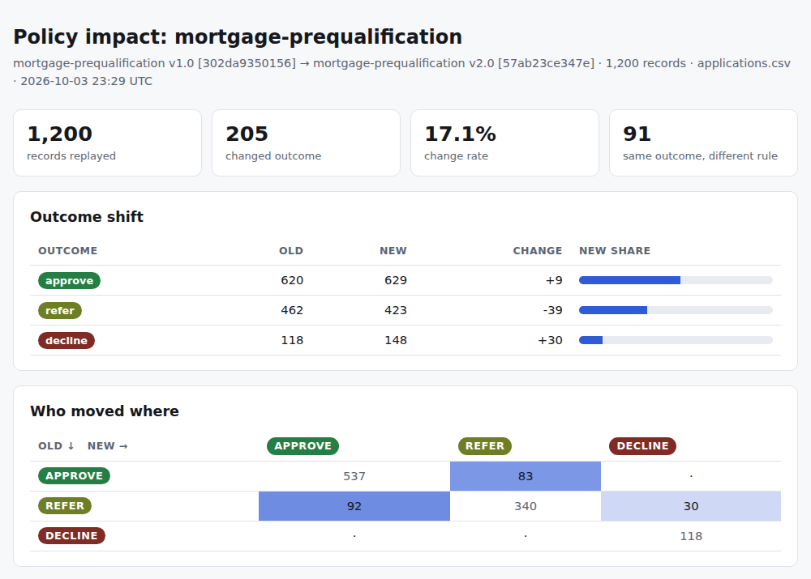

# RuleLens

**Explainable business-rule decisions, with static analysis and policy impact diffing.**

[](https://github.com/DroDigital/2/actions/workflows/ci.yml)


Loan approvals, fraud screens, claims triage, trial eligibility, access requests: most
organisations run on rules that live in code or spreadsheets. Three things usually go wrong:

1. **Nobody can explain a decision**: to a customer, an auditor, or the next engineer.
2. **Nobody knows what a rule change will do** until it ships and the complaints arrive.
3. **Missing data silently becomes "no"**, and rules quietly stop mattering.

RuleLens treats rules as reviewable code and answers those three questions:

| | |
|---|---|
| **Why was this decided?** | Every decision carries its reasons, the clauses and values behind each rule, and the exact policy version that made it. |
| **What would this change do?** | Replay history through the old and new policy, see who moves where and which rule drove it, and gate the change in CI. |
| **Is the policy itself sound?** | A type checker and a static analyser find misspelled fields, rules that can never fire, and rules that are shadowed by others, with no data required. |

<p align="center"></p>

*`rulelens diff ... --html report.html` writes a self-contained page (no JavaScript, light and
dark themes) you can attach to a change ticket. The data is synthetic.*

It is a small library and CLI with **no runtime dependencies**, a hand-written parser (no `eval`),
and a test suite that checks its own static analysis against the evaluator with property-based
tests.

## Try it in a minute

```bash
git clone https://github.com/DroDigital/2 rulelens && cd rulelens
pip install -e .

rulelens lint examples/lint_demo/policy.toml          # find mistakes in rules
rulelens test examples/lending/policy.toml            # run the policy's embedded tests
rulelens decide examples/lending/policy.toml --set credit_score=612 annual_income=72000 \
    monthly_debt=2900 loan_amount=310000 property_value=360000 employment_months=8 bankruptcies_7y=0
rulelens simulate examples/lending/policy.toml examples/lending/applications.csv --group-by region
rulelens diff examples/lending/policy.toml examples/lending/policy_v2.toml \
    examples/lending/applications.csv --group-by region --html report.html
```

### A policy is a reviewable file

```toml
[policy]
name = "mortgage-prequalification"
version = "1.0"
strategy = "most_severe"                     # the worst outcome among matching rules wins
outcomes = ["approve", "refer", "decline"]   # ordered least to most severe
default = "approve"
on_unknown = "refer"                         # missing data fails safe, not open

[schema]
credit_score = "int"
annual_income = "number"
monthly_debt = "number"

[derived]
dti = "monthly_debt * 12 / annual_income"

[[rules]]
id = "DTI_EXCESSIVE"
when = "dti > 0.50"
outcome = "decline"
reason = "Debt-to-income ratio {dti:.1%} exceeds the 50% hard limit"

[[tests]]
name = "extreme debt is declined"
input = { credit_score = 700, annual_income = 50000, monthly_debt = 3000 }
expect = "decline"
expect_rules = ["DTI_EXCESSIVE"]
```

Full reference: [docs/language.md](docs/language.md).

## What it does

### 1. Explains every decision

```
$ rulelens decide examples/lending/policy.toml --set credit_score=612 ...
Decision: REFER   (mortgage-prequalification v1.0 [302da9350156])
  • Debt-to-income ratio 48.3% is above the 43% guideline
  • Credit score 612 is in the borderline band (580-639)
  • Loan-to-value 86.1% with a credit score of 612 needs review
  • Employment tenure of 8 months is under the 12-month minimum for auto-approval

  Rules
    · CREDIT_SCORE_LOW → decline
      credit_score < 580 → false  [credit_score=612]
    ✔ DTI_HIGH → refer  (decisive)
      dti > 0.43 → true  [dti=0.483333]
    ✔ SCORE_BORDERLINE → refer  (decisive)
      credit_score >= 580 → true  [credit_score=612]
      credit_score < 640 → true  [credit_score=612]
    ...
```

Every applicable reason is listed (not just the first), which is what an adverse-action notice
needs, and every clause shows the values it saw. `--format json` produces an audit-log record.
The same thing from Python:

```python
from rulelens import Policy

policy = Policy.load("examples/lending/policy.toml")
decision = policy.decide({"credit_score": 612, "annual_income": 72_000, ...}, trace=True)

decision.outcome      # 'refer'
decision.decisive     # ('DTI_HIGH', 'SCORE_BORDERLINE', 'LTV_HIGH_WEAK_CREDIT', 'THIN_EMPLOYMENT')
decision.reasons      # human-readable, with the actual values filled in
decision.policy       # mortgage-prequalification v1.0 [302da9350156]
decision.to_dict()    # JSON-serialisable, including per-clause traces
```

### 2. Treats missing data as a first-class concept

Rules use three-valued logic: a missing field is *unknown*, not false. A rule that cannot be
evaluated does not fire, but the decision says so, and `on_unknown` makes the policy fail safe:

```
$ rulelens decide examples/lending/policy.toml --set annual_income=72000 ... --brief
Decision: REFER   (mortgage-prequalification v1.0 [302da9350156])
  • Could not evaluate rule(s) CREDIT_SCORE_LOW, SCORE_BORDERLINE because credit_score is missing
    or invalid; escalated to 'refer'.
  Missing data: credit_score
```

A known decline is never softened by missing data, and `false and unknown` is still `false`, so
optional fields need no special-casing.

### 3. Finds problems in the rules themselves

```
$ rulelens lint examples/lint_demo/policy.toml
examples/lint_demo/policy.toml: 2 warnings, 2 infos
  warning W102 rules[FREE_TIER_CRITICAL].when: rule is shadowed by earlier rule 'SEVERE': whenever
    this rule matches, that one matches first, so this rule never decides an outcome
  warning W101 rules[IMPOSSIBLE].when: rule can never fire (the conditions on 'severity'
    contradict each other)
  info I201 schema.region: schema field 'region' is not used by any rule
  info I203 policy has no embedded [[tests]]; add some so changes are checked
```

Expressions are statically typed, so `incom > 3` or `income < "high"` fail at load time with a
caret and a suggestion, instead of silently evaluating to "unknown" in production. The
shadow/redundancy analysis is **sound but incomplete**: what it reports is always true, and
[tests prove that against the evaluator](docs/architecture.md#static-analysis).

### 4. Shows what a policy change would do before it ships

```
$ rulelens diff examples/lending/policy.toml examples/lending/policy_v2.toml \
      examples/lending/applications.csv --group-by region
Replayed 1,200 records: 205 changed outcome (17.1%), 91 kept their outcome for different reasons

Outcomes
               old      new   change
  approve      620      629       +9
  refer        462      423      -39
  decline      118      148      +30

What drove the changes (deciding rule: old → new)
  THIN_EMPLOYMENT → (default): 92
  (default) → SCORE_BORDERLINE: 64
  DTI_HIGH → DTI_EXCESSIVE: 19
  ...
Outcome by region — new policy (favorable outcome: approve)
  North  n=348  favorable  58.9%  ratio   1.000
  South  n=312  favorable  39.1%  ratio   0.664  ⚠ below 0.80 of best group
```

The headline approval rate barely moves (+9), but one in six applicants gets a different
outcome, and the audit shows one group's ratio getting worse. Neither is visible without
replaying the change. As a CI gate, `--max-change-rate 0.10` exits with status 3 when more
than 10% of records would change.

`--group-by` audits a column the policy never reads, which is the right way to look for
disparate impact. The ratio is the "four-fifths" screening heuristic: a prompt to investigate,
not a legal or statistical finding.

## One engine, many industries

All of these are in [`examples/`](examples), with synthetic data and embedded tests:

| Example | Domain | Strategy | Shows |
|---|---|---|---|
| [`lending`](examples/lending) | mortgage pre-qualification | most severe wins | derived ratios, fail-safe on missing data, v1 → v2 impact diff, group audit |
| [`fraud`](examples/fraud) | card-not-present payments | most severe wins | velocity and geo signals, review-queue trade-off in a v1 → v1.1 diff |
| [`claims`](examples/claims) | insurance triage | first match | ordered decision table, date arithmetic, unreadable dates route to a human |
| [`trials`](examples/trials) | clinical-trial pre-screening | most severe wins | inclusion/exclusion criteria, optional fields handled by three-valued logic |
| [`lint_demo`](examples/lint_demo) | support-ticket routing | first match | deliberate mistakes the linter finds |

Only the schema and rules change between them; there is no domain-specific code. The clinical
and lending examples are **illustrations on made-up data, not domain guidance**.

## Quality

* **336 tests**, 97% line and branch coverage, `mypy --strict`, `ruff`, run on Python 3.11-3.13.
* **Property-based tests** verify the hard parts instead of sampling them: parse/print round-trip
  over random ASTs, the evaluator against Python's own semantics, and every claim the static
  analyser makes against the evaluator over 1,500 records including missing values.
  The tests were also checked against deliberately broken analyser variants (one surfaced a
  subtle missing-data bug exactly as designed).
* **Examples are tested as code**: each policy must lint clean and pass its own tests; datasets
  must be reproducible from the seeded generator.
* **Safe by construction**: no `eval`, no regular expressions or loops in rules, bounded
  expression size and depth, and all text in HTML reports is escaped (tested with hostile input).

**Speed** (`python benchmarks/bench.py`, one core of a shared cloud container, Python 3.11):
roughly 24-32 thousand decisions per second including CSV coercion, and 8-12 thousand with full
clause tracing. Linting an 8-rule policy takes well under a millisecond. It is plain Python:
fine for batch replays and services at moderate volume, not for millions of decisions a second.

## How it works

```
policy.toml ─► lexer ─► Pratt parser ─► type checker ─► Policy ─► decide() ─► Decision
                                                   │                  │
                                      static analysis (lint)     simulate / diff ─► text · JSON · HTML
```

Design notes, the soundness argument for the analyser, and trade-offs are in
[docs/architecture.md](docs/architecture.md). The language and every diagnostic code are in
[docs/language.md](docs/language.md).

## Limitations

Stated plainly, so you know what you are getting:

* A library and CLI, not a platform: no UI, persistence, authoring workflow or server.
* Not for very high throughput; numbers are floats (use integer cents for exact money).
* The analyser is sound, not complete: it ignores arithmetic across fields, function calls,
  dates and integer-ness, so some dead rules go unreported.
* It evaluates your rules; it cannot tell you whether they are lawful or fair.

Ideas for next steps: counterfactual explanations ("what would flip this decision"), checking
outcomes against labelled history (precision and recall), SARIF output for GitHub code scanning,
and DMN import/export.

## Development

```bash
pip install -e ".[dev]"
make check          # ruff, mypy --strict, pytest with coverage
make bench
python examples/generate_data.py   # regenerate the synthetic datasets (deterministic)
```

See [CONTRIBUTING.md](CONTRIBUTING.md). Licensed under the [MIT License](LICENSE).
